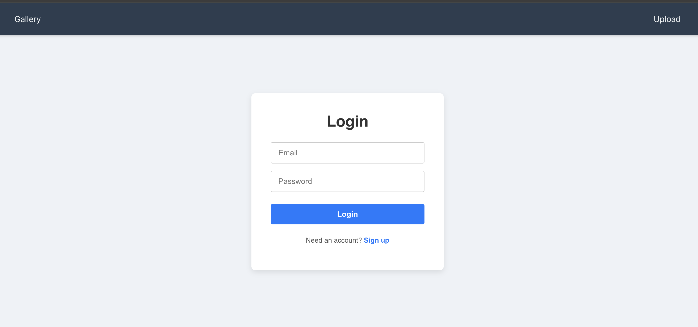
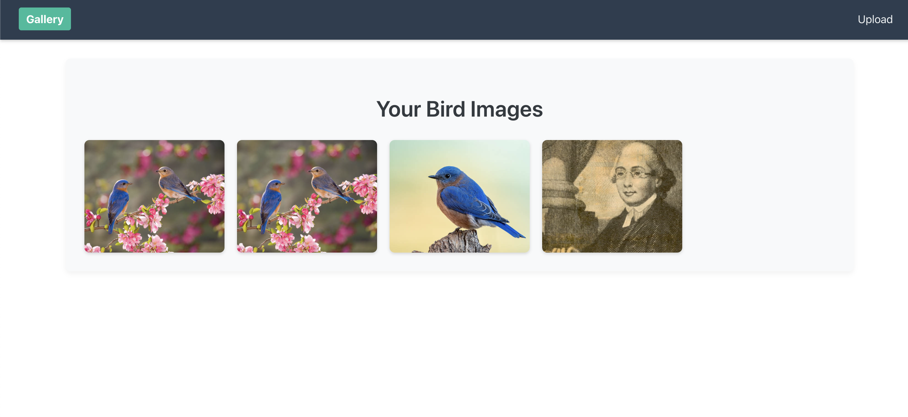

I wanted to build a frontend js project with a stripe + auth integration and used Grok 3 to guide my development cycle. 

After getting rate limited by Grok 3, I used Gemini 2.5 Flash to guide my CSS of this project. 

This project connects to a Test Stripe env, a Mongo cluster for auth. A .env file will be needed in both /frontend and /bird-watcher/backend folders to get that working.

Some Pictures of the application so far 

